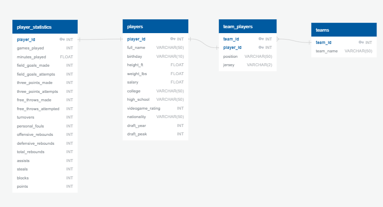

# NBA 2K20 Player Statistics
<em>Aaron Wollman, Kelsey Richardson Blackwell, Will Huang</em>

## Description
This project is to create a production database that contains both real-life and game data for players in NBA2K20.

## Prerequisites
### Configuration Files
In order to run the code in this project, a <b>config.py</b> file must be created by copying [config-template.py](config-template.py) and renaming it within the root directory. Replace the variables in the file with your PostgresSQL username and password.

### Create the Database
The production database must be created before any code can be run for this project.
In order to create the database, follow these directions:
<ol>
	<li>
		Open an instance of pgAdmin.
	</li>
	<li>
		Create a PostgresSQL database and name it NBA_2K20_DB.
	</li>
    <li>
        Run <a href="database/schema.sql">schema.sql</a> within the new database.
    </li>
	<li>
		In the sidebar under the database that ran schema.sql, open Schemas > public > Tables.
		There should be 4 tables:
        <ul>
            <li>Players</li>
            <li>Statistics</li>
            <li>Team Players</li>
            <li>Teams</li>
        </ul>
         A refresh might be required by Right Click > Refresh.
	</li>
</ol>

Here is what the database should look like:
](database/schema-diagram.PNG)

## Extract - Transform - Load
In [etl.ipynb](etl.ipynb), data is extracted from the csv files in [/data](/data), transformed to suit the database created above, and then is loaded into that database.

### How to Run
<ol>
      <li>Before moving on, make sure that the steps in the Prerequisites section have been completed.</li>
	  <li>In a terminal, initialize an Anaconda environment using "source activate <i>{your environment}</i>".</li>
	  <li>Open Jupyter Notebook using "jupyter notebook" in the terminal.</li>
	  <li>In the Jupyter Notebook, open the ipynb file that contains the code.</li>
	  <li>
	    With the code open, you have two options on how to run the code:
	    <ul>
	      <li>
		In the menu bar open Kernel > Restart and Clear Output.  Then you can use Shift+Enter to run the code one block at a time.
	      </li>
	      <li>In the menu bar open Kernel > Restart and Run All.  This will run all of the blocks of code at once.</li>
	    </ul>
	  </li>
</ol>

## Verification
To make sure the ETL process has completed successfully, there are some test queries in [queries.sql](database/queries.sql) to run through.

### How to Run
<ol>
	<li>
		Open an instance of pgAdmin.
	</li>
	<li>
		Open the NBA_2K20_DB database.
	</li>
    <li>
        Run <a href="database/queries.sql">queries.sql</a> within the database.
    </li>
    <li>
        Verify that all of the queries in that file run and that the output of each query looks correct.
    </li>
</ol>
